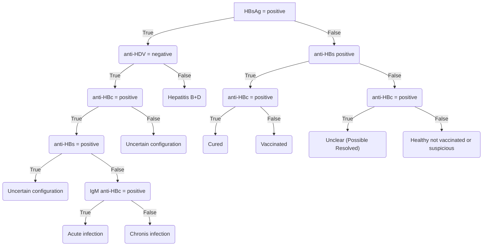

# Hepatitis-B-Prediction

## Decision Tree
Berikut decision tree yang digunakan untuk melakukan prediksi terkait kondisi seseorang terkait dengan Hepatitis B

```mermaid
graph TD
%% Height = 0
A[HBsAg = positive]

%% Height = 1
A --> |True| B(anti-HDV = negative)
A --> |False| C(anti-HBs  positive)

%% Height = 2
B  -->|True| D(anti-HBc = positive)
B  -->|False| E(Hepatitis B+D)
C  -->|True| F(anti-HBc = positive)
C  -->|False| G(anti-HBc = positive)

%% Height = 3
D  -->|True| H(anti-HBs = positive)
D  -->|False| I(Uncertain configuration)
F  -->|True| J(Cured)
F  -->|False| K(Vaccinated)
G  -->|True| L("Unclear (Possible Resolved)")
G  -->|False| M(Healthy not vaccinated or suspicious)

%% Height = 4
H  -->|True| N(Uncertain configuration)
H  -->|False| O(IgM anti-HBc = positive)

%% Height = 5
O  -->|True| P(Acute infection)
O  -->|False| Q(Chronis infection)
```